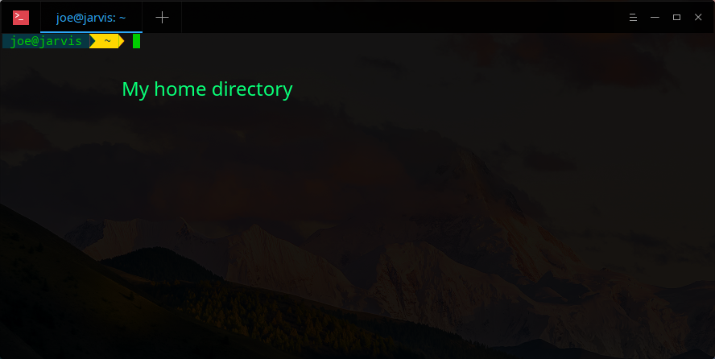
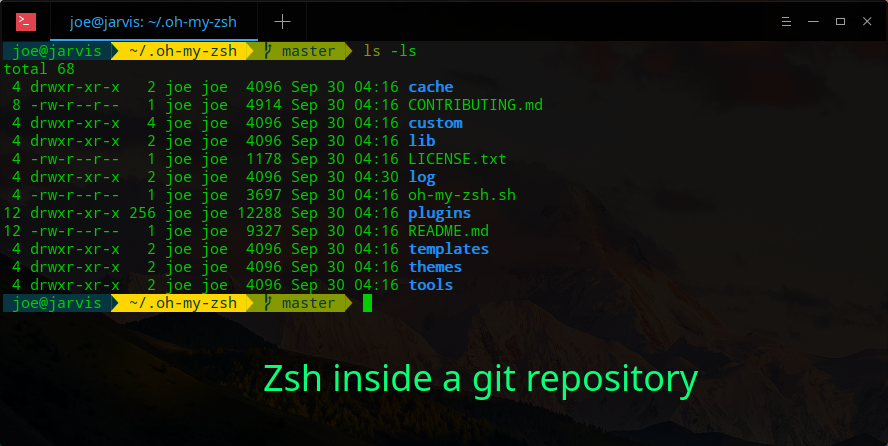

# zsh & fish terminal configuration files and history backup

.zshrc and omf.fish config files and history backup

***

# :fire: Installing Zsh on a new machine

> Ensure you have git installed on the machine

- Clone this repo
- Open the files and edit instances of `/home/joe` to your user and change anything that points to a partion noy found in your machine
- Change the file to an executable script by running `chmod +x zsh-installer.sh`
- Now run the file as follows`./zsh-installer.sh` to install zsh and configure it to look as below.

***
### Using Zsh inside a git repository directory :rocket:

